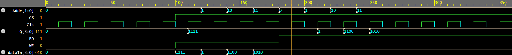

<div align="center">

# CMOS Design Project: 7T MCPL SRAM Cell
 <br>
## Indian Institute of Information Technology, Nagpur  
**ECL 312: CMOS Design**  
**A Project Report on: 7T MCPL SRAM Cell and 2x2 SRAM Array**

**Submitted By:**  
[Jjateen Gundesha (BT22ECI002)](https://github.com/Jjateen)  

**Under the Guidance of:**  
Prof. Paritosh Peshwe  

**Department of Electronics and Communication**  

</div>

## Project Overview

This repository contains the design, simulation, and analysis of a **7T MCPL (Multi-Clock Power Logic) SRAM cell** and its **2x2 SRAM array**, utilizing **adiabatic logic** for enhanced power efficiency. This project compares the performance of a conventional **6T SRAM** and the novel **7T MCPL SRAM** design under **180nm CMOS technology**. Tools like **WinSpice**, **Microwind**, and **Cadence Virtuoso** were used for circuit layout and Static Noise Margin (SNM) analysis.

Adiabatic logic, with its energy-recycling capabilities, is employed in the **7T MCPL SRAM cell** to achieve significant power savings compared to traditional CMOS designs.

## Objectives

1. **Design and simulate** a 7T SRAM cell using **MCPL adiabatic logic**.
2. Implement a **2x2 SRAM array** using the 7T MCPL design.
3. Compare the performance of the **6T SRAM** and **7T MCPL SRAM** designs.
4. Demonstrate power and energy savings achieved by the MCPL design under **180nm technology**.
5. Simulate **read** and **write operations** of both the SRAM cell and array.
5. Analyze the **Static Noise Margin (SNM)** of both designs, using **Cadence Virtuoso** for SNM plotting.

## Design Description

### 6T SRAM Cell
The 6T SRAM cell is a conventional SRAM design, featuring two cross-coupled inverters for data storage, composed of:
- **6 transistors** (4 for inverters, 2 for access transistors).
- Higher power dissipation compared to the 7T MCPL design.

#### 6T SRAM Circuit
<div align="center">
    
</div>

### 7T MCPL SRAM Cell
The 7T MCPL design employs **adiabatic logic** principles, specifically **Multi-Clock Power Logic (MCPL)**, to reduce power consumption:
- **7 transistors**, with an additional transistor for enhanced stability.
- **AC power supply** through MCPL to recycle energy, significantly reducing power.
- Control signals **S1** and **S2** manage the MCPL node, transitioning between high, low, and floating states based on the operating mode.

#### 7T MCPL SRAM Circuit
<div align="center">
    
</div>

### 2x2 7T SRAM Array with MCPL
The 2x2 SRAM array consists of **four 7T SRAM cells** arranged in a matrix. This configuration allows testing of larger memory structures based on the 7T MCPL design, with each cell controlled independently via shared **row and column selection lines**.

## SystemVerilog Code Snippets

### SRAM Module

This code defines a 4-location SRAM module with 4-bit data storage per location.

```systemverilog
module SRAM(
    input [3:0] dataIn,      // 4-bit input data
    input [1:0] Addr,        // 2-bit address
    input CS, WE, RD, Clk,   // Chip Select, Write Enable, Read Enable, Clock
    output reg [3:0] Q       // 4-bit output for all SRAM locations (q1, q2, q3, q4)
);
    // 4 memory locations (4-bit each)
    reg [3:0] SRAMs [3:0];  // 4 memory locations (SRAM[0] to SRAM[3])

    // Initialize SRAM and outputs to 0 at startup
    initial begin
        SRAMs[0] = 4'b0000;
        SRAMs[1] = 4'b0000;
        SRAMs[2] = 4'b0000;
        SRAMs[3] = 4'b0000;
        Q = 4'b0000;  // All outputs start as 0
    end

    // Write/Read operation and update Q
    always @(posedge Clk) begin
        if (CS == 1'b1) begin
            if (WE == 1'b1 && RD == 1'b0) begin
                // Write to SRAM at the specified address
                SRAMs[Addr] <= dataIn;
                Q <= dataIn;  // Q reflects the value written to the SRAM
            end else if (RD == 1'b1 && WE == 1'b0) begin
                // Read from SRAM at the specified address
                Q <= SRAMs[Addr];  // Q reflects the current data at the address
            end
        end
    end

    // Always update the output Q to reflect the state of all SRAMs
    always @(*) begin
        Q = {SRAMs[3], SRAMs[2], SRAMs[1], SRAMs[0]};  // Concatenate SRAMs to form Q
    end
endmodule
```

### Testbench for SRAM Module

The testbench verifies the read and write functionality of the SRAM module.

```systemverilog
module SRAM_tb();
    // Inputs
    reg [3:0] dataIn;   // 4-bit data input
    reg [1:0] Addr;     // 2-bit address for 4 locations
    reg CS, WE, RD, Clk;

    // Outputs
    wire [3:0] Q;        // 4-bit output for all SRAM locations (q1, q2, q3, q4)

    // Instantiate the Unit Under Test (UUT)
    SRAM uut (
        .dataIn(dataIn),
        .Addr(Addr),
        .CS(CS),
        .WE(WE),
        .RD(RD),
        .Clk(Clk),
        .Q(Q)
    );

    initial begin
        // Initialize Inputs
        dataIn = 4'b0000;
        Addr = 2'b00;   // Start with address 00
        CS = 1'b0;
        WE = 1'b0;
        RD = 1'b0;
        Clk = 1'b0;

        // Create the VCD file and dump the variables
        $dumpfile("waveform.vcd");  // Name of the VCD file
        $dumpvars(0, SRAM_tb);      // Dump all variables in the testbench

        // Wait for global reset to finish
        #100;

        // Test Writing to the SRAM cells
        CS = 1;
        WE = 1;
        RD = 0;
        dataIn = 4'b1010;
        Addr = 2'b00;
        #10 Clk = ~Clk;
        #10 Clk = ~Clk;

        // Test Reading from the SRAM cells
        WE = 0;
        RD = 1;
        #10 Clk = ~Clk;
        #10 Clk = ~Clk;

        $finish;
    end
endmodule
```
<div align="center">
    
</div>


## Spice Files

Below are snippets of the circuit files used for simulation in **WinSpice**:

### 6T SRAM Write Mode

```spice
.model nmod nmos level=54 version=4.7
.model pmod pmos level=54 version=4.7

.subckt inverter 1 2 3
M1 3 1 0 0 pmod w=100u l=10u
M2 3 1 2 2 nmod w=100u l=10u
.ends

Vdd 2 0 dc 5
Vwl 6 0 dc 5

Vbit 7 0 pulse(0 5 0 0 0 100m 200m)
Vbitbar 8 0 pulse(5 0 0 0 0 100m 200m)

Xq 1 2 3 inverter
Xqbar 3 2 1 inverter

M5 7 6 3 3 pmod w=100u l=10u
M6 8 6 1 1 pmod w=100u l=10u

.tran 0.1m 400m
.control
run
plot v(7) v(8) v(3) v(1)
.endc
.end
```

### 7T MCPL SRAM Write Mode

```spice
.model nmod nmos level=54 version=4.7
.model pmod pmos level=54 version=4.7

.subckt inverter G Sp D
M1 D G 0 0 nmod w=100u l=10u
M2 D G Sp Sp pmod w=200u l=10u
.ends

Vdd 2 0 dc 5
Vwl 6 0 dc 5
Vwlb 9 0 dc 0
Vbit 7 0 dc 5
Vbitbar 8 0 dc 0
Vs1 13 0 pulse(0 5 0 0 0 200m 400m)
Vs2 11 0 pulse(0 5 0 0 0 100m 200m)

Xq 1 10 3 inverter
Xqbar 3 10 1 inverter

M5 7 6 3 3 nmod w=100u l=10u
M6 8 6 1 1 nmod w=100u l=10u
M7 3 9 3 0 nmod w=100u l=10u
M9 10 11 2 2 pmod w=200u l=10u
M10 10 13 0 0 nmod w=100u l=10u

.tran 0.1m 400m
.control
run
plot v(7) v(8) v(3) v(1) v(13) v(11)
.endc
.end
```

### 7T MCPL SRAM 2x2 Array

```spice
*** 7T MCPL SRAM 2x2 Array ***

* NMOS and PMOS Models *
.model nmod nmos level=54 version=4.7
.model pmod pmos level=54 version=4.7

* Inverter Subcircuit *
.subckt inverter in out vdd
M1 out in vdd vdd pmod w=200u l=10u
M2 out in 0 0 nmod w=100u l=10u
.ends inverter

* Transmission Gate NAND Gate Subcircuit (for decoding) *
.subckt transmission_gate_nand a0 a1 a1_bar out
M1 out a1 a0 0 nmod w=100u l=10u
M2 out a1_bar a0 0 pmod w=200u l=10u
M3 out a1_bar 0 0 nmod w=100u l=10u
M4 out a1 0 0 pmod w=200u l=10u
.ends transmission_gate_nand

* Sense Amplifier Subcircuit *
.subckt sense_amp BL BL_bar OUT Vdd
M1 OUT BL 0 0 nmod w=100u l=10u
M2 OUT BL_bar 0 0 pmod w=200u l=10u

M3 OUT BL_bar Vdd Vdd pmod w=200u l=10u
M3 OUT BL Vdd Vdd nmod w=100u l=10u
.ends sense_amp

* Write Amplifier Subcircuit *
.subckt write_amp DATA BL BL_bar Vdd
Mw1 BL DATA 0 0 nmod w=100u l=10u
Mw2 BL_bar DATA Vdd Vdd pmod w=200u l=10u
Mw3 BL DATA 0 0 pmod w=200u l=10u
Mw4 BL_bar DATA Vdd Vdd nmod w=100u l=10u
.ends write_amp

* 7T MCPL SRAM Cell (Corrected subcircuit reference) *
.subckt sram_cell BL BL_bar WL WL_bar Vdd
Xinv1 BL BL_bar Vdd inverter
Xinv2 BL_bar BL Vdd inverter
M5 BL WL 0 0 nmod w=100u l=10u
M6 BL_bar WL 0 0 nmod w=100u l=10u
M7 BL WL_bar BL 0 nmod w=100u l=10u
.ends sram_cell

* Row Decoder Subcircuit (Corrected node connections) *
.subckt row_decoder a0 a1 a1_bar Vdd out
Xnand a0 a1 a1_bar out transmission_gate_nand
.ends row_decoder

* Column Decoder Subcircuit (Corrected node connections) *
.subckt col_decoder a0 a1 a1_bar Vdd out
Xnand a0 a1 a1_bar out transmission_gate_nand
.ends col_decoder

* Main Circuit for 2x2 SRAM Array *

Vdd 2 0 dc 2
* Wordline and Bitline Drivers *
VWL 6 0 dc 2
VWL_bar 9 0 dc 0
VBL 7 0 pulse(0 2 0 0 0 50m 100m)
VBL_bar 8 0 pulse(2 0 0 0 0 50m 100m)
Vamp 19 0 dc 5v
* Row/Column Selection Pulses *
Vs1 13 0 dc 2
* Wordline select 1
Vs2 11 0 dc 0
* Wordline select 2
Vc1 15 0 pulse(0 2 0 0 0 200m 400m)
* Column select 1
Vc2 17 0 pulse(0 2 0 0 0 100m 200m)
* Column select 2

* 2x2 SRAM Array (Corrected subcircuit connections) *
Xsram1 7 8 6 9 2 sram_cell
Xsram2 7 8 13 9 2 sram_cell
Xsram3 7 8 6 17 2 sram_cell
Xsram4 7 8 13 17 2 sram_cell

* Row Decoder (Fixed parameter count) *
Xrow_decoder_1 6 13 11 2 out1 row_decoder
Xrow_decoder_2 6 17 11 2 out2 row_decoder

* Column Decoder (Fixed parameter count) *
Xcol_decoder_1 7 15 11 2 out3 col_decoder
Xcol_decoder_2 8 17 11 2 out4 col_decoder

* Sense Amplifier and Write Driver (Fixed node 10) *
V10 10 0 dc 0
* Grounding node 10 to fix floating issue
Xsense_amp 7 8 18 19 sense_amp
Xwrite_amp 10 7 8 2 write_amp

* Simulation Commands *
.tran 0.1m 400m
.control
run
plot v(7) v(8) v(18) v(10)
.endc
.end
```
## Layout and Waveforms

### 6T SRAM Layout
<div align="center">
    
</div>

### 7T MCPL SRAM Layout
<div align="center">
    
</div>

### 7T MCPL SRAM 2x 2 Array Layout
<div align="center">
    
</div>

### 6T SRAM Waveforms


### 7T MCPL SRAM Waveforms


### 7T MCPL SRAM 2x2 Array Waveforms


### 6T SRAM SNM
<div align="center">
    
</div>

### 7T MCPL SRAM SNM
<div align="center">
    
</div>


## Static Noise Margin (SNM) Analysis

The **SNM** was calculated and plotted using **Cadence Virtuoso**. The SNM analysis indicates the stability of the **6T** and **7T MCPL SRAM** cells. This analysis was performed by inscribing a **maximum square** within the butterfly curve, plotting the inverter voltage transfer characteristics.

- **6T SRAM**: Shows a smaller area in the butterfly curve, indicating lower stability.
- **7T MCPL SRAM**: Demonstrates a **0.3 times greater SNM** than the 6T SRAM, reflecting improved stability and noise tolerance.

The increased SNM of the 7T MCPL SRAM is due to the added transistor and better isolation of the internal nodes, as described in the **Why is the 7T MCPL SRAM more stable than the 6T SRAM?** section.

## Performance Comparison

### Power and Energy Consumption

Simulation results show a significant reduction in power and energy consumption using MCPL logic. Below are the power and energy figures for both designs under **180nm and 32nm technology**:

| SRAM Cell                        | Power (W)     | Energy (J)        | Power (W) (32nm) | Energy (J) (32nm) |
|-----------------------------------|---------------|-------------------|------------------|-------------------|
| **6T SRAM**                      | 85.6e-6       | 15.4e-9           | 4.6e-6           | 0.64e-12          |
| **7T SRAM**                      | 90.2e-6       | 6.32e-9           | 24.9e-6          | 13.4e-12          |
| **7T SRAM with MCPL**             | 30.1e-7       | 117.9e-15         | 5.4e-7           | 40.5e-15          |

### Stability (SNM)

The **Static Noise Margin (SNM)** analysis shows that the **7T MCPL SRAM** design is **0.3 times more stable** than the 6T SRAM design, providing enhanced stability and noise resilience.

### Why is the 7T MCPL SRAM more stable than the 6T SRAM?

1. **Additional Transistor**: The 7T

 design incorporates an extra transistor for improved node isolation and stability.
2. **Energy-Recycling via MCPL**: The MCPL architecture reduces power dissipation, improving noise immunity.
3. **Lower Noise Disturbance**: By reducing noise disturbances on internal nodes, the 7T SRAM achieves a greater **SNM**, signifying better tolerance to environmental noise.

## Conclusion

The **7T MCPL SRAM cell** provides significant improvements in power efficiency, stability, and noise resilience compared to the traditional **6T SRAM** design. Using **adiabatic logic** and MCPL, this project demonstrates the feasibility of low-power, high-stability SRAM designs.

### Future Work

Future enhancements could explore:
1. **Scaling** the design to smaller technology nodes for further efficiency gains.
2. **Integrating additional noise management techniques** for environments with high electromagnetic interference.

## References

1. M. Beiser, "Low Power CMOS Circuits," IEEE Journal of Solid-State Circuits, vol. 35, no. 5, pp. 745-749, 2000.
2. A. G. Alley, "Adiabatic Logic: A Survey," Proceedings of the IEEE, vol. 90, no. 3, pp. 339-358, March 2002.
3. P. Meher, "CMOS VLSI Design," Addison-Wesley, 2008.
4. Cadence Virtuoso, "Custom IC and PCB Design," Cadence Design Systems, Inc.
5. Microwind, "CMOS Layout & Simulation Software," Silvaco Inc.

This project is based on the work described in the following paper:

> **Penugonda, R.S., & Ravi, V.** (2020). *Design of Low Power SRAM Cell Using Adiabatic Logic*. Journal of Physics: Conference Series, 1716(1), 012039. doi:10.1088/1742-6596/1716/1/012039【6†source】
